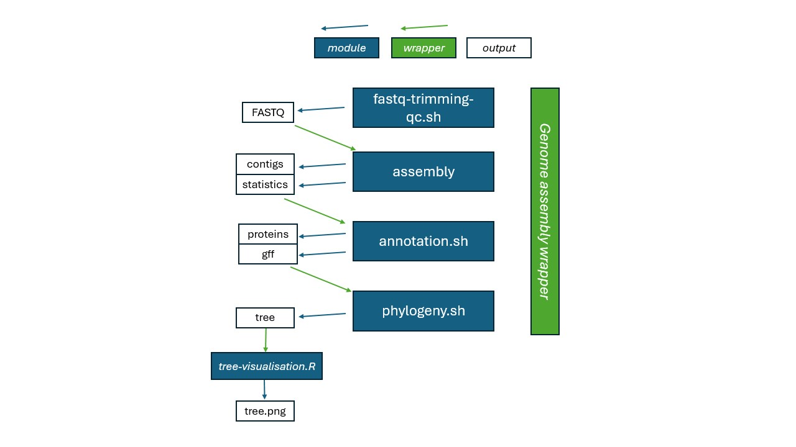
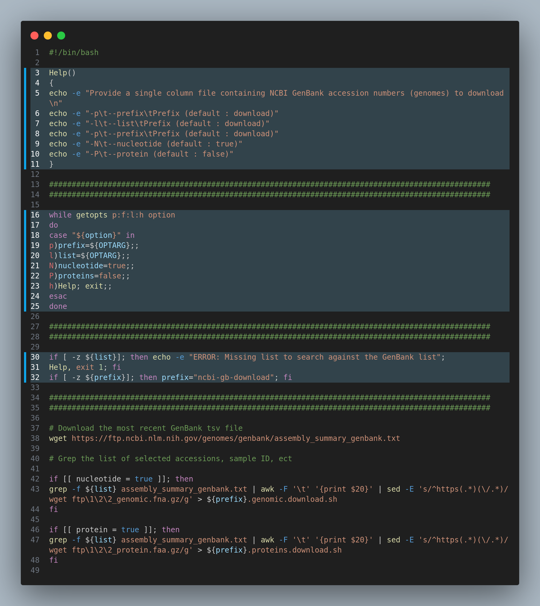
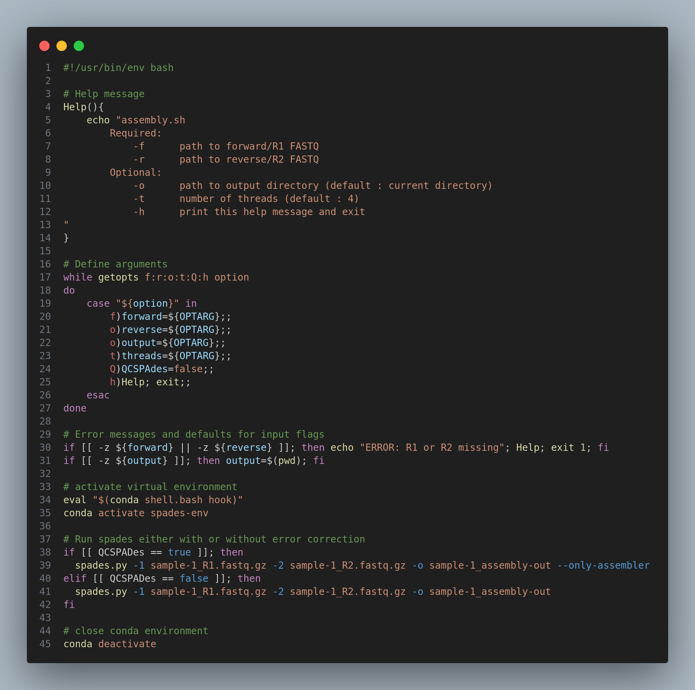

# Anatomy of a BASH (WIP)
Level: Advanced beginner-Intermediate | 2024-10-03

CAUTION ITS VERY MESSY HERE

***
## Table of Contents

***

## Introduction
For a long time my bioinformatic analyses were very laborious and slow. This was a result of my scripts being built specifically for a particular sample(s), possibly a consequence of the way most bioinfomatics courses/tutorials are taught, which is to have a single sample going through a process at one time, using a loops to parse through multiple samples. Once the quantity of data being procesed at any single timepoint scales up, you can end up over-relying on loops to go parse through all my samples at each step which can make then incredibly slow and limiting. Paths were specific to a certain data/directories, defined variables were specific to the server I was using at the time, ect. While this is not a unusual way to perform your genomic analysis and data processing, it can all fall apart when you move institute, share scripts/data, or try to make the scripts/data publically available. Just know that BASH is not always the best language for achieving this (python is a good alternative), but if all you know is a little BASH and havent had the time to learn Python, or another laguage, this guide is to help you start writing some multi-sample functioning scripts that can be submitted to server and help you generate lots of data in consistent manners that can be shared with colleagues, and immediately deposited into project repositories for reviwers and readers to utilise.

### Aims:

The main aim of this guide is to show you ways to write BASH, R and Python scripts that: 
1. Perform single/limited function(s) - suitable for any appropriate data-type for that function/programme (*modular scripts*)
2. Using data located in any part of the computer/server
3. Producing outputs in a default or specified location/name
4. Has useful help messages
5. Produces usefull error mesages
6. Can be submited to any server type (e.g. SunCluter, SLURM).

### Definitions
A lot of these termsn/phrases should be familiar to you already if you have been running commands in a termina and submitting jobs to a high-performing computer. Some of these terms are my own descrption of things, they might not be universily recognised, but it is how I think of them (Table 1).

<details>
<summary>Table 1. Glossary of terms</summary>

| **Term** | **Definition**  |
|------|-------------|
| **Functions** | A Bash function is a block of reusable code designed to perform a particular operation. Once defined, the function can be called multiple times within a script.  |
| **HPC**  | High performing computers  |
| **Loops: <code>for</code>** | A BASH <code>for</code> loop is a programming language statement which allows code to be repeatedly executed for a selection of data (i.e. <code>for file in read/*R1_fastq.gz; do</code> \| meaning for every R1 file in the reads directory, perform the following) |
| **Loops: <code>until</code>**  | A BASH <code>until</code> loop is executes a code block repeatedly until a specific condition becomes true. |
| **Loops: <code>while</code>**  | Perform an action <code>while</code> an expression is true, keep executing these lines of code. |
| **Modular scripts**| Scripts that are not limited by location or data, and can be chained by a workflow manager  |
| **HPS: Modules**  | The *module system* is a concept available on most supercomputers, simplifying the use of different software (versions) in a precise and controlled manner. |
| **Pipeline**  | A pipeline is a series of processes, usually linear, which filter or transform data. The processes are generally assumed to be running concurrently. The first process takes raw data as input, does something to it, then sends its results to the second process, and so on, eventually ending with the final result being produced by the last process in the pipeline. Pipelines are normally quick, with a flow taking seconds to hours for end-to-end processing of a single set of data. |
| **Statements: <code>elif</code>**  |  The <code>elif</code> statement, stands for “*else if*”. It can be used in conditional statements to check for multiple conditions. For example, if the first condition is false, it moves on to the next “elif” statement to check if that condition is true.  |
| **Statements: <code>else</code>**  | An <code>else</code> statement pecifies that alternate processing is to take place when the conditions of the matching IF statement are not satisfied  |
| **Statements: <code>if</code>**  | An <code>if</code> statement is a programming construct that allows you to make decisions based on certain conditions. It helps you control the flow of your program by executing different blocks of code depending on whether a given condition is true or false.  |
| **Variable**| A BASH variable acts as temporary storage for a string or a number. Variables also make it easy for users to write complex functions and perform various operations. Users can create variables by giving them a name and a value. A name can be anything. (e.g. <code>${input}</code>) | 
| **Workflow** | a set of processes, usually non-linear, often human rather than machine, which filter or transform data, often triggering external events. The processes are not assumed to be running concurrently. The data flow diagram of a pipeline can branch or loop. There may be no clearly defined "first" process -- data may enter the workflow from multiple sources. Any process may take raw data as input, do something to it, then send its results to another process |

</details>

***
## Anatomy of a BASH script

### Modular scripts
Since most of my script are sent to a computing cluter, they must be send in the form of a BASH script (some servers do accept python scripts, though I have had a problem in the past with activing conda). For simple local operations, such as using <code>seqkit</code> to check the number of reads of a FASTQ/A file, I use them as is, but when I want to perform an assembly and QC the contics, I would write a simple script that I can send to a cluster.

I find it is helpful to approach script writing with modularity at the forefront (Figure 1). I like to breakdown all the primary functions I need for specific tools with lots of inputs and outputs, and how can I make it such that data from any project can be fed into it, and the outputs can be utilised by the next programme contained within another script. When you take this moduler approach, you are able to wrap all your individual scripts using a wrapped (i.e NextFlow, Snakemake) to build more complete pipelines that can perform something like: **raw FASTQ &rarr; Adaptor trimming and QC &rarr; Assembly &rarr; contig QC &rarr; Annotation &rarr; Phylogeny**. You might not always need to write your own, as there is a wealth of tools for bacterial and viral genomics available. But if you are working a non-model organism, or want to use tools built specifically for a specific organism, then you may have to write your own workflows.


<small>**Figure 1.** Workflow example of a genome assembly composed of five scripts (modules, blue) that performs individual analysis and are chained by the wrapper script (green)</small>

I like to think of scripts as often composed of three parts, a set-up, the main, and the closing. The set up for the script will include things such as defining argument flags, parameters, opening virtual environments (if needed), help function, setting up a log output. The main will compose of the primary purpose of the scripts, to run a specific or series of programmes, and the closing of the script will include anything got wrap it all up. 

This tutorial will mostly dicuss the setup of a script, as that is where you can refine your script to be modular. In the example blow you can see highlighted the what that setup might look like (Figure 2.). 


<small>**Figure 2.** Example script that downloads from NCBI the assembly data for bacterial genomes and accepts a list of bacterial genome accession IDs to download either the nucleotides or proteins. Highlighted is the part of the script that will be covered in this guide.</small>

### Starting your script with a bang
The the first line of a BASH script is called a *shebang*, and it specifies which interpreter/language will be used when executing the script. You might see a few different versions of this, and they can change the way your script operates.

- <code>#!/usr/bin/env bash</code> : This is **generally the safest choice in an HPC environment** if your script requires bash-specific features. Using env  ensures the bash interpreter is found via the environment's PATH, which can be modified by the module system. Useful in HPC environments, where modules may alter the available shell or software versions.
- <code>#!/bin/bash</code> : This assumes bash is located in /bin/bash, which is usually true for most Linux-based HPC systems. However, this can be less flexible if the HPC system has bash installed in non-standard locations or if you need different versions of bash.
- <code>#!/bin/sh</code> : If your script doesn’t require any bash-specific features and you just need a simple, lightweight script for tasks like job submission, basic file handling, or running commands.
- <code>#!/bin/sh -</code> : This is a more niche use case, and usually, you won’t need to run your HPC scripts in a login shell unless your environment setup is complex and isn't automatically inherited from your job scheduler.

### Printing a help message

A help message is just a chunk of text, and unlike in R and Python is actually detached from the argument definement (covered below). This means, that just because you write it in your help message, doesnt actually mean it is reflected in the defined arguments. Because of this, I prefere to have the help message written before writing the argument definition, as it helps remind me exactly what I need. For this you simply define a function called <code>Help()</code>, and open up the function with curly brakets <code>{</code>. The help message itself it just generated using <code>echo</code>. After the message is written, you close the function with another curly braket <code>}</code>. The help message can be called simply by using the new command <code>Help</code>, in your script.

Possition wise this should be placed before the argument definement, as one flag will to call the help function (<code>-h</code>), it needs to be defined before.

```{sh}
Help(){
    echo "Help message for the script: my script
        Required:
            -i      path to input file
            -o      path to output file
        Optional:
            -t      number of threads (default : 4)
            -h      print this help message and exit
}

Help # to print the help message
```

### Defining arguments

One way to achieve a multi-sample functioning script very simply is to feed files into your script, rather than have the target file/values defined in the script. The most basic way to do this in BASH is to just add them to the end of you line of code:

```{sh}
# write the example script
echo "#!/usr/bin/env bash
      eval "$(conda shell.bash hook)"
      conda activate spades
      spades.py -1 ${1} -2 ${2} -o ${3}
      conda deactivate
" > assembly.sh

# This script could be run as follows
assembly.sh sample-1_R1.fastq.gz sample-1_R2.fastq.gz sample-1_assembly-out
```

Your inputs are defined sequentially, so the first file/value following <code>assembly.sh</code> becomes the variable <code>\${1}</code>, the second <code>\${2}</code>, so on. This is not the most user-friendly, and if you are going to be sharing scripts with colleagues it can be clunky for others. This is why its valuable to write script that have help mesages and defined flags. Using the same example as above, but this time there is a input flag for the required files (R1 and R2 reads), and an output directory:

```{sh}
assembly.sh -i sample-1_R1.fastq.gz -r sample-2_R1.fastq.gz -o sample-1_assembly-out
```

First, we need to define the arguments for the script, and this is achieved using the <code>while getopts a\:b:c:h option; do</code>. Which looks scarier than it actually is. This is utilising a <code>while</code> statement to search for input flags, before here as <code>i\:o:t:h</code>, which just means it will search for <code>-i</code>, <code>-o</code>, <code>-t</code>, and <code>-h</code>. Next those flags are defined into variables, for example the input flag it is defined as such: <code>i)input=${OPTARG};;</code>.

```{sh}
while getopts i:o:t:Q:h option
do 
    case "${option}" in 
        i)input=${OPTARG};;
        o)output=${OPTARG};;
        t)threads=${OPTARG};;
        Q)QCSPAdes=false;;
        h)Help; exit;;
    esac
done
```

Now for the rest of the script, whenever you call the variable <code>${input}</code>, the script will utilised whatever file/value was provided when the script was run (e.g. <code>-i path/to/contigs.fasta</code>). This is done for all the flags you need for your script to operate as intended while providing flexibility. The input doesnt need to be file paths, it can be values, chunks of text.

You can change this to have as many or as few arguments as you want. It is important to ensure that your help message (encoded in the function <code>Help</code> as described above), is as written to reflect the contents of the <code>while</code> argument. When the help message is called (e.g. <code>assembly.sh -h</code>), the script will terminate immediately after printing the help message, you acheive this by having the default bash function <code>exit</code> in <code>h)Help; exit;;</code>. 

A final feature you can take advatage of is utilising a <code>true</code>/<code>false</code> statement in the argument definement (e.g <code>Q)QCSPAdes=false;;</code>). For example, the assembler  SPAdes perform an optional read error correction by default, but if you perform error correction prior you may want to disable this with the SPAdes specific flag <code>--only-assembler</code>. In the example script the the flag <code>-Q</code> is added for when you want SPAdes to only perform the assembly, or omit the flag it in order to resort to the default setting, which in the example is false (i.e. perform/do not disable error correction). If you do this, you will later have to include an <code>if</code> statement in order to enact this in both a <code>true</code> and <code>false</code> scenario (this will be covered later).

### Producing error messages 

When you begin incorporating flags, its important that you set up some error messages to help people troubleshoot why the script might not be working for them. As by default, the error messages produced by BASH might not be the most informative to someone unfamiliar with the language.

Recall in the help message there where two types of input flags, required and optional. Lets go about creating error messages based on those two categories, starting with the required arguemnts. In a scenario where a user did not define a required arguments, we need to inform users what they have missed. We will do this with <code>if</code> statements.

```{sh}
if [[ -z ${inpput} ]]; then echo -e "ERROR: -i, input is missing"; Help, exit 1; fi
```
The logic of this <code>if</code>  statement, is in the situation where <code>-i</code> is not defined - the <code>-z</code> string - which means that the if statement is true if the string is empty (i.e. human language: <code>\${input}</code> does not exist/is empty because <code>-i</code> was not provided), then the following action is performed. That action is to print a message (<code>"ERROR: -i, input is missing"</code>), then call the <code>Help</code> function, which will print the help message to remind the user what the flags of the script are, then close the script with exit 1. If the statemet is not true (i.e human language: <code>\${input}</code> is not empty, before a input was provided), the <code>if</code> statement ends (<code>fi</code>, for finish), and the script continues. There are additional features to <code>if</code> statements that will be covered later, but they are very powerful tools to utilise in your script.

For optional argument, we don't need to colapse the script if no file or value was provide when the scrip was run, instead default value/path can be utilised. In the help message, we stated that the default number of threads was 4. So we set it as such using another <code>if</code> statement. 

```{sh}
if [[ -z "${threads}" ]]; then threads=4; fi
```

The same logic as before is applied, except this time we set the threads variable to the default value before ending the <code>if</code> statement (<code>threads=4; fi</code>). Now in the script, unless a <code>-t</code> value was given, whenever <code>${threads}</code> is called the default value will be used. You can even add more to this statement, to include a message to inform the user that the default value has been applied. 

Have a go and write the following if statements:

1. For the optional <code>-t</code> flag, add a message that the number of threads is the default value.
2. An error message for the scenario where <code>-o</code> has not been provided
3. Make the <code>-o</code> an optional flag and default the output directory to the current working directory

<details>
  <summary>Reveal solution to 1</summary>
Since <code>${threads}</code> has a value, it is useful to use the variable instead of a hard number, as at some point in the future you might change the value of the default, and you want to have a script where you need to change that value in as few places as possible. In the present example, you would only have to change that value in two places: the <code>if</code> statement and the <code>Help</code> message. 

  ```{sh}
  if [[ -z "${threads}" ]]; then 
    threads=4; 
    echo "Number of threads not specified, utilising default value ${threads}; fi
  ```

</details>

<details>
  <summary>Reveal solution to 2</summary>
Simply need to add a echo to the <code>if</code> statement. This can be personalised hower you want as long as it is informative to the user.

  ```{sh}
  if [[ -z ${output} ]]; then echo -e "ERROR: -o, output is missing"; Help, exit 1; fi
  ```

</details>

<details>
  <summary>Reveal solution to 3</summary>
To define the output as the working directory you will need to use the function <code>$(pwd)</code>, which print the full path to the curren working directory. That is how we define the output. Same as in (1), we will use the variable <code>${output}</code> to report the output path.

  ```{sh}
  if [[ -z ${output} ]]; then 
    output=$(pwd); fi
    echo -e "Output path is missing, defaulting to current directory: ${output}"
  ```

</details>

### Generating logs-files

Log files are invaluable for troubleshooting your scripts, or having a record of every run of your script (think of them as a lab book entry). You might not always keep all logs, but they are useful for looking back and remining yourself of what parameters the script was run using.

First we want to create an accrate time-point in the format of YYYYMMDDHHMMSS, this might seem excessive, but considering you could be running this script multiple time making small adjustments, you want each logfile to be completely unique to not overwrite them. To achieve that we create a variable that contains the log file name. First create a variable called <code>${logfile}</code>, we use the default BASH function <code>date</code>, and specifiy the date format <code>'+%Y%m%d%H%M%S'</code>. We then add the suffix <code>.log</code> to the file name.

```{sh}
logfile="$(date '+%Y%m%d%H%M%S')".log
```

Now with the logfile name defined as a variable (<code>${logfile}</code>), we redirect both standard output (<code>stdout</code>) and standard error (<code>stderr</code>) to a log file, while also displaying them on the terminal at the same time. Let's break it down step by step:

```{sh}
exec > >( tee -a "${logfile}" ) 2>&1
```

- <code>exec</code> changes the behavior of stdout and stderr for the rest of the script, 
- <code>stdout</code> (<code>></code>) is redirected into a process substitution: <code>>( tee -a "${logfile}" ) </code>. This sends the output to the <code>tee</code> command. 
- <code>tee</code> displays the output on the terminal (as usual) and appends it to the file <code>${logfile}</code>. 
- <code>2>&1</code> redirects stderr to the same destination as stdout, meaning that errors are also both displayed on the terminal and written to the log file.

```{sh}
logfile="$(date '+%Y%m%d%H%M%S')".log
exec > >( tee -a "${logfile}" ) 2>&1
```

With that you will generate a output containing the standard outputs and the standard errors, which is great for troubleshooting your code. If you are routinely sending scripts to a HPC, the submission manager of that HPC more than likely generates log files, so you might not actually need this unless you want to hoard log files. 

### Environment setup

Now that much of your script is defined for function, you can begin setting up the working environment to utilise your desired function. This might include defining paths to databases, or opening a conda enviroment. This is a very personalised process for your script and I wont cover mush, but will make a note about conda.

#### 1. Conda
When running conda in a HPC, you often have to configure your shell environment for conda. This command is typically required to properly initialize conda within a shell session, especially if the conda base environment isn't automatically loaded by default (e.g., when you don't have conda in your PATH at shell startup). So if you are struggling to get conda working in your HPC, this might be why.

```{sh}
eval "$(conda shell.bash hook)"
conda activate assembly-env
```
#### 2. Printing flag parameters
If you are going to be generating a log-file for a record of your analysis/data processing, I find it useful to print you very close to the start of the string a list of all the variables utilise in the flags, data paths, data-files used, ect. This might look like this

```{sh}
echo "Running assembly.sh with the following parameters
SampleID: "${sample}"
R1: "${forward}"
R2: "${reverse}"
Minimum read length: ${min_rlen}
Minimum contig length: ${min_clen}
"
```

Alternatively you could opt to print this out as a .csv file containing your run parameters. 
Personalising your scripts is very simple, and can be easily modified to meet your experimental needs. 

```{sh}
echo "${logfile};${forward}:${reverse};${min_rlen};${min_clen}" >> assembly.params.log
```


### Making a pretty script!
In the long matrix stream of text that can be printed to you terminal, it is often useful to have important text stand out. This could be a missing file, non-existent paths, location of output file...

Adding color to you script can be definted very easily. First you must indicate the color of the text needs to change using: <code>\033[</code>. This open up all subsequent text to a color change, BUT no color has been defined yet. To define a color your must add the approporiate ANSI escape codes (Table 1). For red text you would define it as: <code>\033[31m</code>. All text that follows this will be green. To revert the color back to default (typically white in a console), you need to close the escape code with a <code>\033[m</code>.

**Table 1.** ANSI color codes and their corresponding colors.

| code | color  |
|------|--------|
| 31m  | red    |
| 32m  | green  |
| 36m  | cyan   |
| 36m  | purple |
| 34m  | blue   |
| 33m  | orange |

A complete example might look something like this (if you are printing text to the console using the command <code>echo</code>, then you also have to add <code>-e</code> to enable interpretation of backslash escapes):

```{sh}
echo -e "\033[31m ERROR: something has gone very wrong because the text is all red!\033[m"
```

This is quite a awkward to add and you can very easily miss a closure, and the the entirely of your console is colored red and you'll feel like you have made a terrible bloody mistake. A work around is to define the colors as a variables at the start of your script:

```{sh}
# Define colors
green='\033[32m'; red='\033[31m'; cyan='\033[36m'; purple='\033[35m'; nocolor='\033[m'
```

This alows you to change the text color as follows:

```{sh}
echo -e "${red}ERROR: something has gone very wrong because the text is all red!${nocolor}"
```

### Adding a timestamp to the end of your script
If your optimising your scripts and trying to get an idea of run-time and computing resources its useful to print out the run time. This is easily done by first creating a timestamp at the  start and the end of your script, the  calculating the elapsed time, then printing the time.

```{sh}
#!/usr/bin/env bash
start_time=$(date +%s) # define start time

#··············································#
#··········· The rest of the script ···········#
#··············································#

finish_time=$(date +%s) # define end time

# Calculate the difference in seconds
elapsed_time=$((finish_time - start_time))

# Convert elapsed time to hours, minutes, and seconds
((sec=elapsed_time%60, elapsed_time/=60, min=elapsed_time%60, hrs=elapsed_time/60))
timestamp=$(printf "Total time taken - %d hours, %d minutes, and %d seconds." $hrs $min $sec)
echo $timestamp

# Print the total runtime
echo -e ""
echo -e ""Total time taken: ${hrs}:${min}:${sec}"

```

If you are testing multiple computing resource allocation and different processing time, you might even consider printing a running table of your experiment along with your run parameters. For example, in the case of a a phylogeny script (<code>phylogeny</code>)
```{sh}
echo -e "phylogeny.sh;${THREADS};${NBOOTSTRAPS};${NUMSEQUENCES};${hrs}:${min}:${sec}" >> computing-time-test.csv
```

### <code>true</code>/<code>false</code> scenarios:

Previously the idea of having a true/false argument for dissabling the error correction of SPAdes, as an example. If you have included an argument for when <code>QCSPADes == true</code> and when <code>QCSPADes == false</code>.

Like before we start the if statement with a scenario, which is <code>QCSPADes == true</code> (for when the -Q flag is uses), then we direct a specific action for that scenario, which is to performs SPADes using the assembly only features disabling the error correction. 

```{sh}

if [[ QCSPADes == true ]]; then 
  spades.py -1 sample-1_R1.fastq.gz -2 sample-1_R2.fastq.gz -o sample-1_assembly-out --only-assembler
···
```

Then we can continue the if statement to include an alternative scenario using an 'else if' (elif) statement, for for scenario when <code>QCSPADes == false</code>, to perform spades with default features. This is also the default functioning of the example script as we defined <code>Q)QCSPADes=false;;</code> at the start of the script.

```{sh}
···
elif [[ QCSPADes == false ]]; then
  spades.py -1 sample-1_R1.fastq.gz -2 sample-1_R2.fastq.gz -o sample-1_assembly-out
fi
```
The entire if argument will look as follows:

```{sh}
if [[ QCSPADes == true ]]; then 
  spades.py -1 sample-1_R1.fastq.gz -2 sample-1_R2.fastq.gz -o sample-1_assembly-out --only-assembler
elif [[ QCSPADes == false ]]; then
  spades.py -1 sample-1_R1.fastq.gz -2 sample-1_R2.fastq.gz -o sample-1_assembly-out
fi
```
#### Not running the script if the output of the tool already exists:
In the example [bin/tb-profiler_v1.sh](URL) you can see that there is an example to search a collated output from previous runs of this scrip before deciing to run the script or not. It uses an <code>if</code> statement to determine wether that particular sampleID exists the output, and if it does not (i.e. ) to run the script. But if the output does exists (i.e. ), the it skips that particuler sample.

```{sh}

```

#### Forcing the script to run even if the output exists:
In a more sophisticated version of the script [bin/tb-profiler_v2.sh](URL) there is an additional flag to force the script to overright the previous output (i.e. ) using a flag of <code>-F</code>.

```{sh}

```

#### Adding a counter if processing multiple samples
If a single process is quick and not computationaly demanding, then loops are a good way to parse through lots of samples at once. I like to add a counter, so that I can keep track of where the script is at when I send it to a HPC.

To add a counter, you first must set the counter at one: <code>COUNTER=1</code>, then you will want to get the total number of samples to be processed: <code>TOTAL=$(ls ${DIRECTORY}/*R1.fastq.gz | wc -l)</code>. With those now defined you can start the loop. In this example the loop is utilising the path <code>${DIRECTORY}</code> and searching for files containing the suffix <code>\*_R1.fastq.gz</code>. This is done to capture the sample ID by using <code>basename</code> to remove the path and suffic of the R1 file.

```{sh}
COUNTER=0
TOTAL=$(ls ${DIRECTORY}/*R1.fastq.gz | wc -l); COUNTER=1
for file in ${DIRECTORY}/*R1.fastq.gz; do
···
```
With the loop open, we can calculate the remaining number of samples to process: <code>REMAINING=$((TOTAL - COUNTER))</code>. Its important to know that shell can only perform simple mathematics, so bear this in mind when using its calculator functions. Then an <code>echo -e</code> is used to report which sample number the loop is on, and how many are remaining: 

```{sh}
···
echo -e "   Sample: ${ID}  [${COUNTER}/${TOTAL}; ${REMAINING} remaining]
                R1: ${DIRECTORY}/${ID}_R1.fastq.gz
                R2: ${DIRECTORY}/${ID}_R2.fastq.gz"
···
```

In this example a tool called TB-Profiler is running on the R1 and R2 FASTQ files, utilising the <code>\${ID}</code> variable defined at the start of the loop for each sample. With the main function defined, we have to remember to increase the counter by 1, so that it increases with the loop to the next file: <code>COUNTER=$((COUNTER + 1))</code>. 

In all this might look something like this:

```{sh}
COUNTER=1 # start the counter
TOTAL=$(ls ${DIRECTORY}/*R1.fastq.gz | wc -l) # get the total

for file in ${DIRECTORY}/*R1.fastq.gz; do
    ID=$(basename "${file}" _R1.fastq.gz)
    
    REMAINING=$((TOTAL - COUNTER)) # Calculate remaining samples

    # Display sample information with the counter
    echo -e "   Sample: ${ID}  [${COUNTER}/${TOTAL}; ${REMAINING} remaining]
                R1: ${DIRECTORY}/${ID}_R1.fastq.gz
                R2: ${DIRECTORY}/${ID}_R2.fastq.gz"

    # Run the profiling command
    tb-profiler profile -1 ${DIRECTORY}/${ID}_R1.fastq.gz \
                        -2 ${DIRECTORY}/${ID}_R2.fastq.gz \
                        -t 4 -p ${ID} --txt
        
    COUNTER=$((COUNTER + 1)) # Increment the counter
done
```

You can even combine the loop with the <code>if</code> statement:

```{sh}
COUNTER=0 # start the counter at zero
for file in ${DIRECTORY}/*R1.fastq.gz; do
    ID=$(basename "${file}" _R1.fastq.gz)
    # Calculate remaining samples
    REMAINING=$((TOTAL - COUNTER))

    # If argument to check that the TB_profile hasnt already been run:
    if [[ ! -f ${TBPROF_DIR}/results/${ID}.results.txt ]]; then
        # Display sample information with the counter
        echo -e "${cyan}\tSample: ${ID}\t\t[$COUNTER/$TOTAL; $REMAINING remaining]\n\t\tR1: ${DIRECTORY}/${ID}_R1.fastq.gz\n\t\tR2: ${DIRECTORY}/${ID}_R2.fastq.gz"
        echo -e "${nocolor}"
        # Run the profiling command
        tb-profiler profile -1 ${DIRECTORY}/${ID}_R1.fastq.gz -2 ${DIRECTORY}/${ID}_R2.fastq.gz -t ${NTHREADS} -p ${ID} --txt
        # Increment the counter
        COUNTER=$((COUNTER + 1))
    elif [[ -f ${TBPROF_DIR}/results/${ID}.results.txt ]]; then
        echo -e "${red}\t${TBPROF_DIR}/results/${ID}.results.txt exists, skipping: ${ID}\t\t[$COUNTER/$TOTAL; $REMAINING remaining]"
        COUNTER=$((COUNTER + 1))
    fi
done
```

### Submitting modular scripts to HCP

Depending on your computing cluster server, you will be able to directly submit these scripts given that you provide sufficient information in your code to run with the necessary computing resources.

**SunGrid system**
For a SunGrid system you have to use <code>qsub</code> as your main command for submitting scripts. Because of how these scripts were writen, there are not cluster specific parameters defined within the script, so they can be defined with the script submission command

```{sh}
qsub 
```


### Example scripts
Here are some examples of scripts, you can also find these scripts in in <code>bin/</code>. Take note how these scripts make use of all that has been discussed in this guide 


